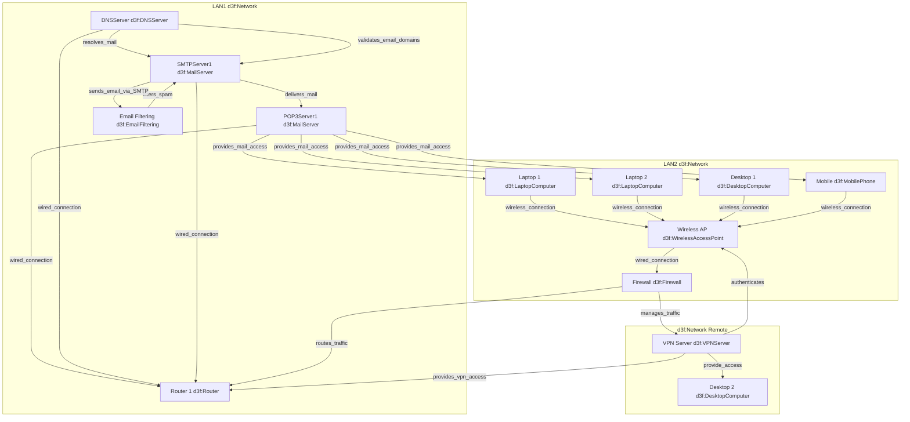

```mermaid
graph TD

subgraph LAN1 ["LAN1 d3f:Network"]
pop3[POP3Server1 d3f:MailServer] -->|wired_connection| router1[ Router 1 d3f:Router]
dnsServer[DNSServer d3f:DNSServer] -->|wired_connection| router1
smtp[SMTPServer1 d3f:MailServer] -->|wired_connection| router1
emailFilter[Email Filtering d3f:EmailFiltering] -->|filters_spam| smtp
dnsServer[DNSServer d3f:DNSServer] -->|resolves_mail| smtp
end

subgraph LAN2 ["LAN2 d3f:Network"]
wifiAP[Wireless AP d3f:WirelessAccessPoint] -->|wired_connection| firewall[Firewall d3f:Firewall]
laptop1[Laptop 1 d3f:LaptopComputer] -->|wireless_connection| wifiAP
laptop2[Laptop 2 d3f:LaptopComputer] -->|wireless_connection| wifiAP
desktop1[Desktop 1 d3f:DesktopComputer] -->|wireless_connection| wifiAP
mobile[Mobile d3f:MobilePhone] -->|wireless_connection| wifiAP
end

subgraph Remote ["d3f:Network Remote"]
vpnServer[VPN Server d3f:VPNServer] -->|provide_access| desktop2[Desktop 2 d3f:DesktopComputer]
end

firewall -->|routes_traffic| router1
firewall -->|manages_traffic| vpnServer
vpnServer -->|authenticates| wifiAP
vpnServer -->|provides_vpn_access| router1

%% Sicurezza email e DNS
smtp -->|sends_email_via_SMTP| emailFilter
smtp -->|delivers_mail| pop3
pop3 -->|provides_mail_access| laptop1
pop3 -->|provides_mail_access| laptop2
pop3 -->|provides_mail_access| desktop1
pop3 -->|provides_mail_access| mobile
dnsServer -->|validates_email_domains| smtp


```