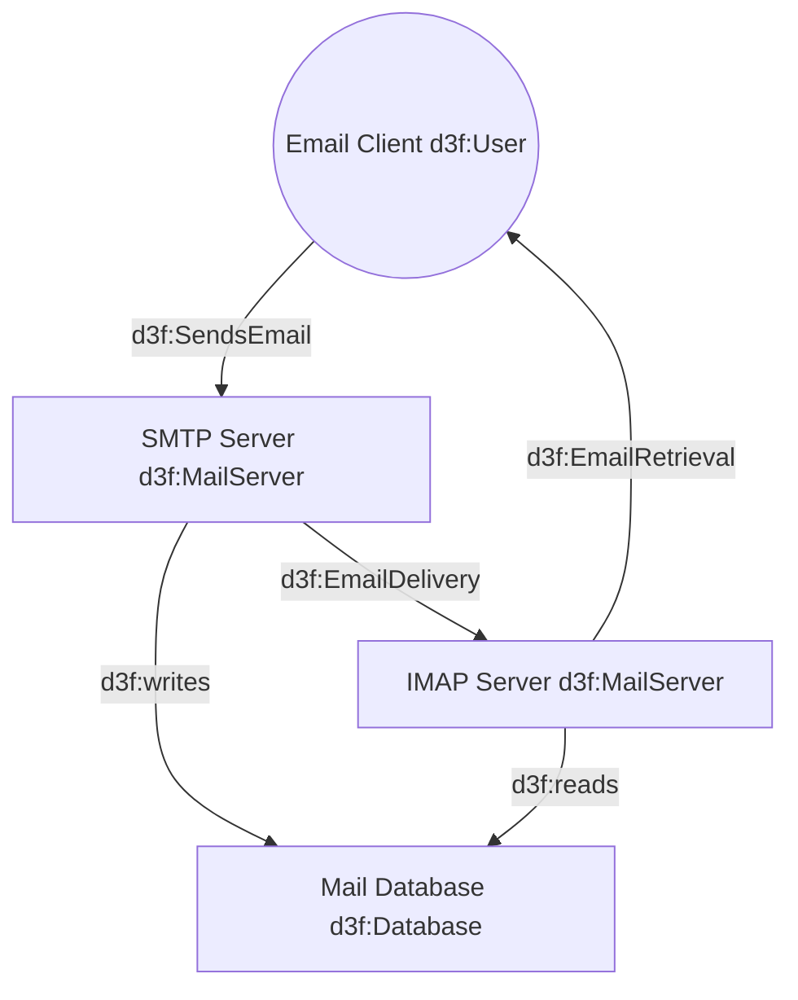

# Simple architecture

```mermaid
graph TD;
    user(("Email Client d3f:User"));
    smtp["SMTP Server d3f:MailServer"];
    imap["IMAP Server d3f:MailServer"];
    maildb["Mail Database d3f:Database"];

    user -->|"d3f:SendsEmail"| smtp;
    smtp -->|"d3f:EmailDelivery"| imap;
    imap -->|"d3f:EmailRetrieval"| user;
    smtp -->|"d3f:writes"| maildb;
    imap -->|"d3f:reads"| maildb;

```

