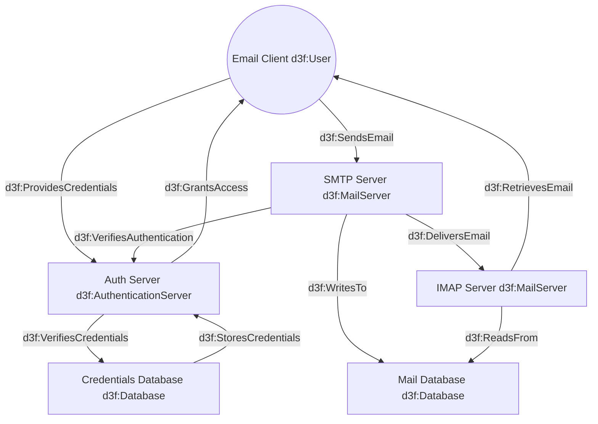

# Simple architecture

```mermaid
graph TD;
    user(("Email Client d3f:User"));
    smtp["SMTP Server d3f:MailServer"];
    imap["IMAP Server d3f:MailServer"];
    maildb["Mail Database d3f:Database"];
    auth["Auth Server d3f:AuthenticationServer"];
    cred_db["Credentials Database d3f:Database"];

    user -->|"d3f:ProvidesCredentials"| auth;
    auth -->|"d3f:VerifiesCredentials"| cred_db;
    cred_db -->|"d3f:StoresCredentials"| auth;
    auth -->|"d3f:GrantsAccess"| user;

    user -->|"d3f:SendsEmail"| smtp;
    smtp -->|"d3f:VerifiesAuthentication"| auth;
    smtp -->|"d3f:DeliversEmail"| imap;
    imap -->|"d3f:RetrievesEmail"| user;
    smtp -->|"d3f:WritesTo"| maildb;
    imap -->|"d3f:ReadsFrom"| maildb;


```

